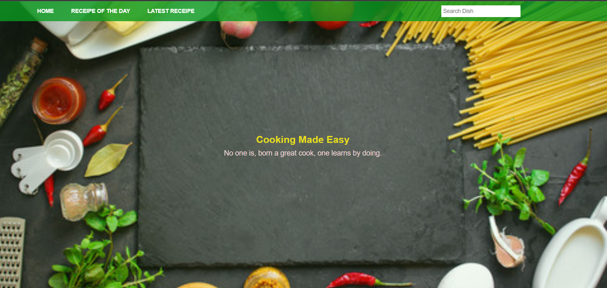
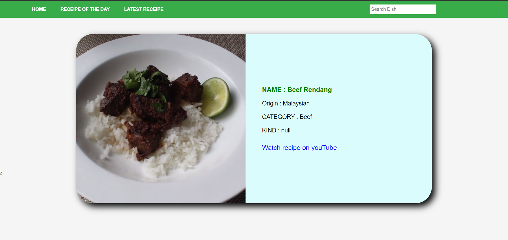
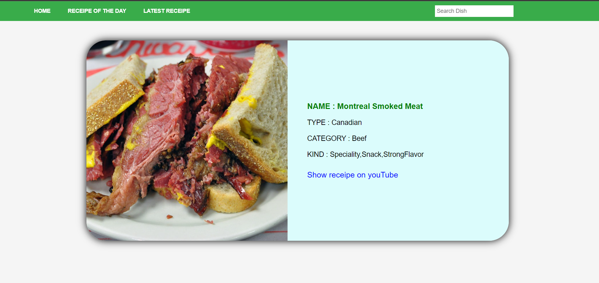
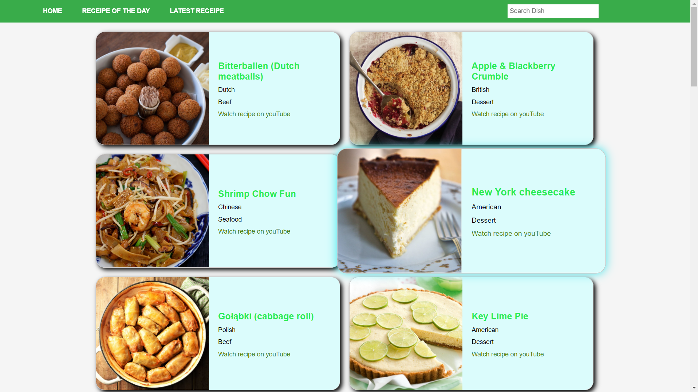

# My Food Recipe App
<h2>It is my first individual web project at Masai. Here you can find the recipe of any food recipe and also youTube video link ogf that recipe.</h2>

<h2>Stack and Libraries Used</h2>
<ul>
  <li>HTML</li>
  <li>Javascript</li>
  <li>Css</li>
  <li>Web API's</li>
  <li>REST API's</li>
</ul>

  
<h3>Deployment Link</h3>
<a href="https://nikhil-food-recipe-app.netlify.app/">https://nikhil-food-recipe-app.netlify.app/</a>

Home Page

Search Result Page

Recipe of the day page

Latest Recipies page

 

<h2>About me </h2>
 

<h3>Nikhil Shakya</h3>
<ul>
  <li>Github:  <a href= "https://github.com/devmanush-forEach" >devmanush-forEach</a></li>
  <li>Email:shakyanikhil12345@gmail.com </li>
  <li>LinkedIn: <a href="https://www.linkedin.com/in/nikhil-shakya-3a1939213/">https://www.linkedin.com/in/nikhil-shakya-3a1939213/ </a></li>
</ul>

 

